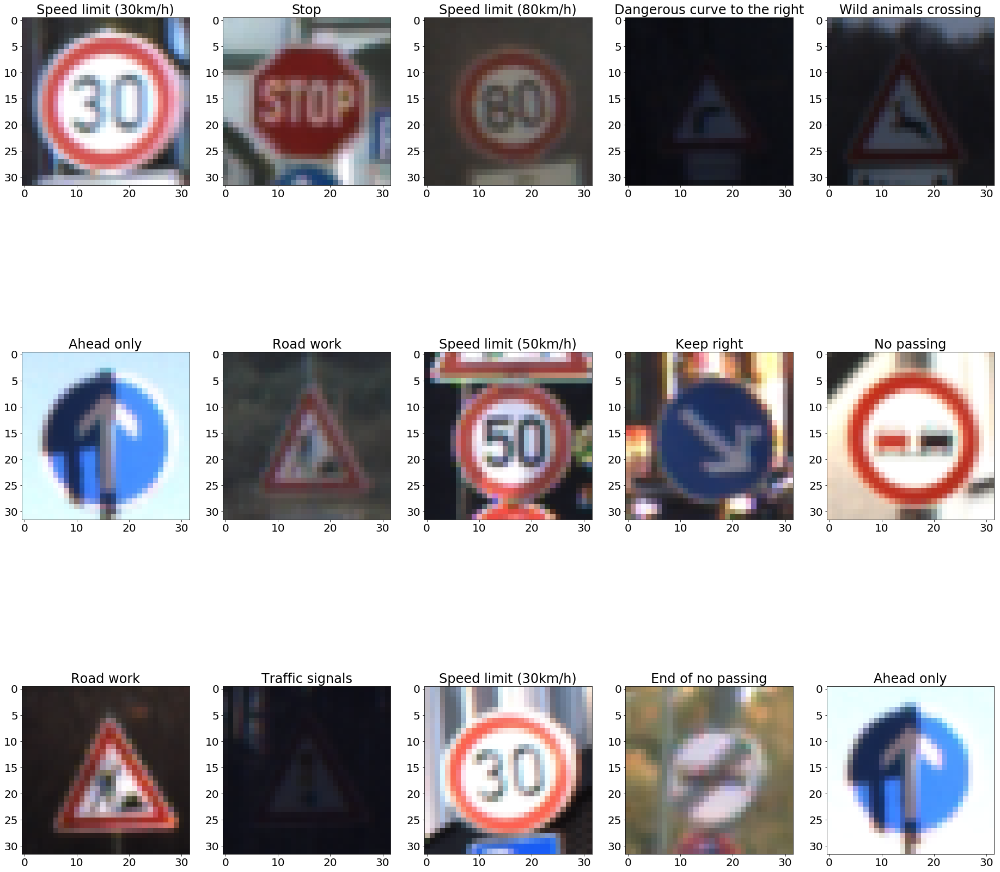

## CNN for Traffic Sign Recognition
[](http://www.udacity.com/drive)

### Overview

The goals of this project is to create and train a Convolutional Neural Network (CNN) for recognizing [German traffic signs](http://benchmark.ini.rub.de/?section=gtsrb&subsection=dataset).  You can find some sample images, and their corresponding labels, below




Key steps in this process are:

* Load the data set
* Explore, summarize, and visualize the data set
* Increase the size of the dataset with augmentation
* Design, train, and test a model architecture
* Use the model to make predictions on new images
* Analyze the softmax probabilities of the new images
* Summarize the results with a written report

### Prerequisites

This model has been created using Python 3.5 and requires Numpy, OpenCV2, Matplotlib, Jupyter, and Tensorflow 1.2+.  For best results, you can clone the entire development Udacity Self-Driving environment using Anaconda ([full setup instructions](https://github.com/udacity/CarND-Term1-Starter-Kit/blob/master/doc/configure_via_anaconda.md)).  If you already have Anaconda , you can setup the environment, called ```carnd-term1```, as follows:

```
conda env create -f environment-gpu.yml
conda clean -tp
```

And activate the environment as:
```
source activate carnd-term1
```

### Use

This project is presented as a Python Jupyter notebook.  After installing all the required software, start your Jupyter notebook server from this directory by running:

```
jupyter notebook
```

You can then open the relevant notebook, [Traffic_Sign_Classifier](./Traffic_Sign_Classifier.ipynb), and run the cells in order


### Authors

* Osman Shawkat
* Forked from [Udacity](https://github.com/udacity/CarND-Traffic-Sign-Classifier-Project)

### License

This project is licensed under the MIT License - see the [LICENSE](LICENSE) file for details

### Acknowledgments

* Algorithm inspiration and starter code courtesy of [Udacity's Self-Driving Car Nanodegree](https://www.udacity.com/course/self-driving-car-engineer-nanodegree--nd013) program - [Upstream](https://github.com/udacity/CarND-Traffic-Sign-Classifier-Project)
* README template courtesy of Bille Thompson - [PurpleBooth](https://github.com/PurpleBooth)
